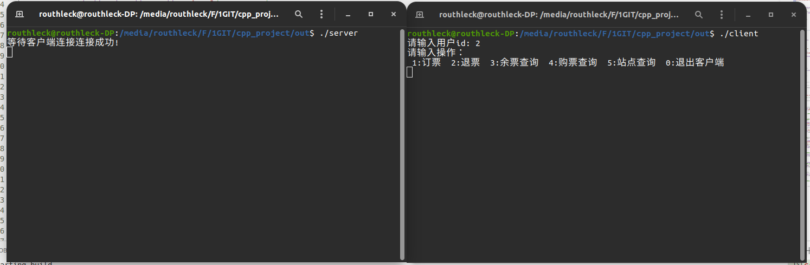
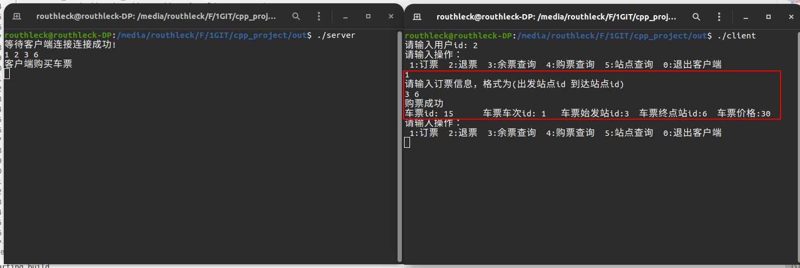
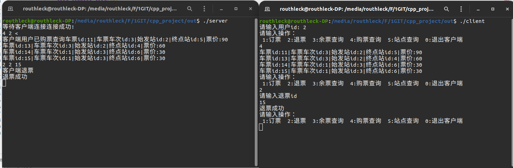
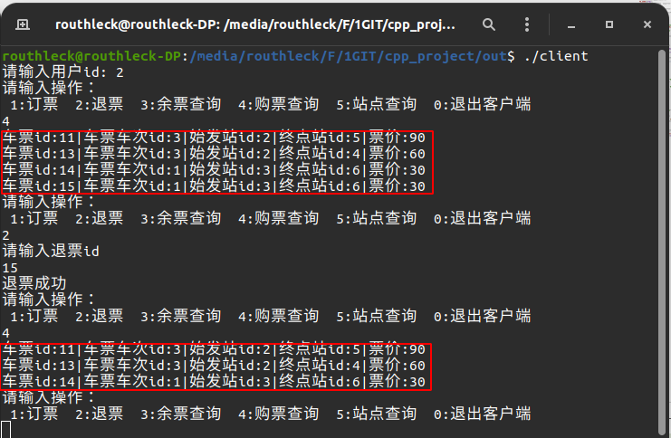
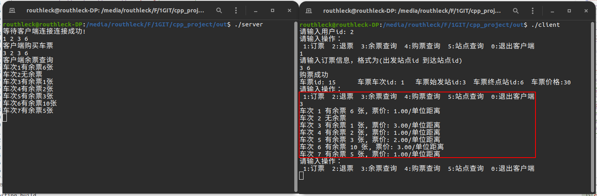
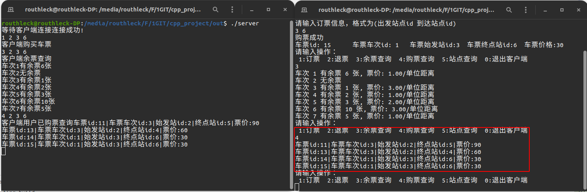
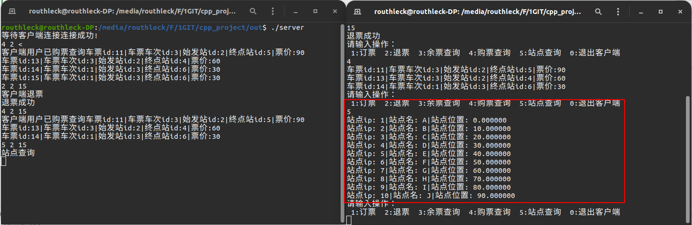
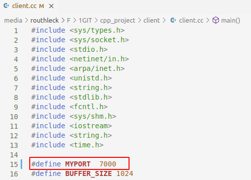
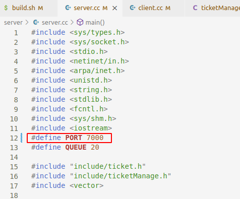

# 编译和使用说明

## 编译说明

本项目使用Server/Client 模式，在代码根目录打开terminal，使用sh build.sh进行编译

## 使用说明

在根目录下生成out文件夹，接着分别使用两个terminal先后打开./server与./client

在客户端输入用户id
便可以输入对应数字来进行操作

### 1. 订票

输入数字1，然后分别输入出发站点id与到达站点（用空格隔开）

显示订票详细信息

### 2. 退票

输入数字2，然后输入退票的id

已成功退票

### 3. 余票查询

输入数字3，显示所有车次余票信息

### 4. 购票查询

输入数字4，显示当前用户的所有购票信息

### 5. 站点查询

输入数字5，显示所有站点信息

### 0. 退出客户端

注意最好使用此方法退出程序，否则可能出现端口占用，导致无法建立连接

若出现端口占用可修改server.cc与client.cc的的DEFINE MYPORT

