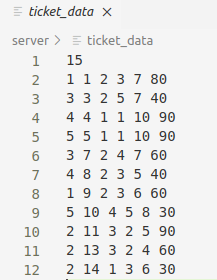

# 订票信息存储的数据结构和设计思路

## 订票信息存储的数据结构

存储在本地的ticket_data文件中



第一行为当前放票id的计数
其余行每行为一张订票信息
依次为订票用户id, 车票id, 车次id, 出发站, 到达站, 车票价格

在程序中使用vector作为容器，类里的属性为：

```c++
private:
    int ticket_id; // 车票id
    int train_id; // 车次id
    int user_id; //用户id
    int ticket_start; // 车票起始站id
    int ticket_end; // 车票终点站id
    int ticket_price; // 车票价格
```

## 设计思路

车票id为当前放票id的计数，每增加一个车票，+1。
车次id为订票时通过放票策略选择的车次id
用户id为当前购票用户id
起始站id为用户购票输入的起始站
终点站id为用户购票输入的终点站
车票价格将根据输入的终点与起点，计算距离并乘上车次的价格/距离得出最终的车票价格

# 放票策略

通过对车次的始发站与终点站相差的站点数进行计算得出该车次的总距离，对应当需要放票时，确定放票的始发站与终点站相差的站点数，此时去除车次总距离小于放票相差的站数，按车次总距离从小到大对排序，依次判断直到找到符合其他项的车站。

# 验证策略效果截图

## 实验准备

### 车站配置

共10个车站

```c++
void init_station(std::vector<station>& stations) {
    stations.push_back(station(1, "A", 0));
    stations.push_back(station(2, "B", 10));
    stations.push_back(station(3, "C", 20));
    stations.push_back(station(4, "D", 30));
    stations.push_back(station(5, "E", 40));
    stations.push_back(station(6, "F", 50));
    stations.push_back(station(7, "G", 60));
    stations.push_back(station(8, "H", 70));
    stations.push_back(station(9, "I", 80));
    stations.push_back(station(10, "J", 90));
}
```

### 车次配置

共20个车次，每个车次均有3个载客量，起始站与终点站不一

```c++

void init_train(std::vector<train>& trains, std::vector<station>& stations) {
    trains.push_back(train(1, 1, 10, 3, 1));
    trains.push_back(train(2, 1, 7, 3, 1));
    trains.push_back(train(3, 2, 5, 3, 1));
    trains.push_back(train(4, 5, 8, 3, 1));
    trains.push_back(train(5, 8, 10, 3, 1));
}
```

### 测试起始站与终点站用例

```c++
int ticket_start_list[] = {8, 8, 8, 5, 5, 5, 2, 2, 2, 1, 1, 1, 1, 1, 1};
int ticket_end_list[] = {10, 10, 10, 8, 8, 8, 5, 5, 5, 7, 7, 7, 10, 10, 10};
```

为15个用例，若合理放票可以满足全部的用例

## 实验过程

分别对应优化的应用算法的测试与未优化的测试

```c++
for (int i = 0; i < 15; i++) {
        
        int ticket_start = ticket_start_list[i];
        // ticket_end 不能等于 ticket_start
        int ticket_end = ticket_end_list[i];
        addTicketNoOptimized(user_id, ticket_num_common, ticket_start, ticket_end, trains, tickets_common, stations);
        addTicket(user_id, ticket_num, ticket_start, ticket_end, trains_common, tickets, stations);
    }
```

## 实验结果

使用算法优化放票策略的上座率: 100%
不使用算法优化放票策略的上座率: 60%